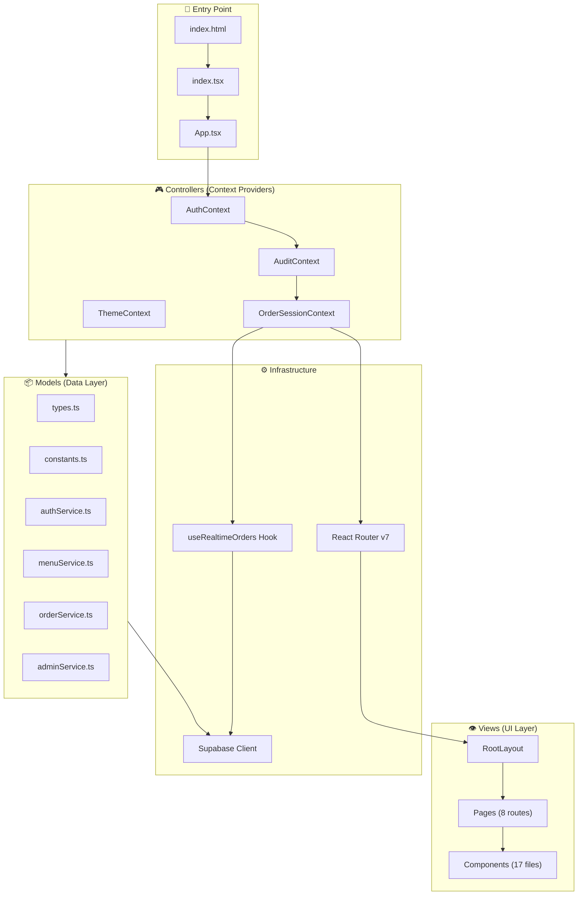
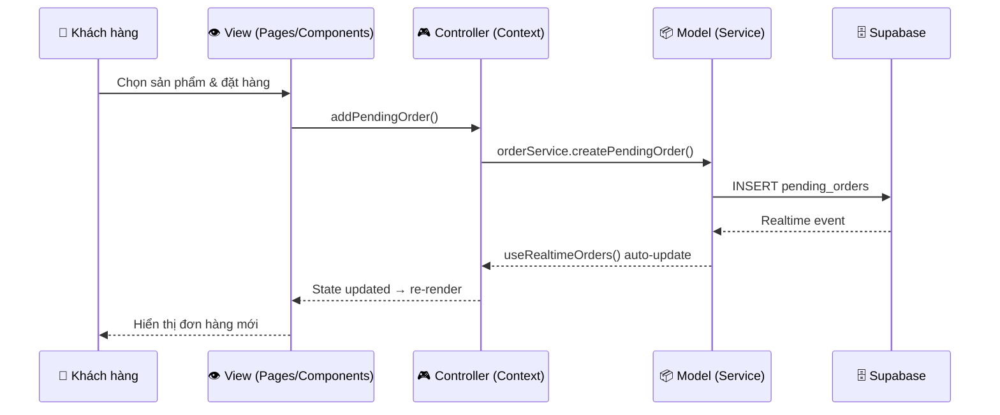

# 📊 Phân Tích Cấu Trúc Source — Katuu Milk Tea

## Tổng Quan

**Katuu Milk Tea** là ứng dụng đặt trà sữa online, xây dựng trên **React 19 + TypeScript + Vite**, backend sử dụng **Supabase** (realtime database), deploy trên **Vercel**. Kiến trúc theo mô hình **MVC (Model-View-Controller)** rõ ràng.

| Thuộc tính | Giá trị |
|---|---|
| Framework | React 19 + Vite 6 |
| Language | TypeScript |
| Styling | TailwindCSS (CDN) |
| Database | Supabase (PostgreSQL + Realtime) |
| Routing | React Router DOM v7 |
| Deploy | Vercel |
| Dev Server | `localhost:3000` |

---

## Cây Thư Mục

```
katuu-milktea/
├── index.html                  # Entry HTML (TailwindCSS CDN, animations CSS)
├── index.tsx                   # React entry point → render <App />
├── App.tsx                     # Root App (duplicate ở root, re-export từ src)
├── styles.css                  # Global styles
├── vite.config.ts              # Vite config (alias @/ → src/, port 3000)
├── tsconfig.json               # TypeScript config
├── tailwind.config.js          # Tailwind config
├── vercel.json                 # Vercel deploy config (SPA rewrite)
├── package.json                # Dependencies
│
├── 📁 src/                     # === SOURCE CODE CHÍNH ===
│   ├── index.tsx               # Re-export App
│   ├── App.tsx                 # Providers wrapper (Auth → Audit → OrderSession → Router)
│   │
│   ├── 📁 config/              # ⚙️ CẤU HÌNH
│   │   └── supabase.ts         # Supabase client initialization
│   │
│   ├── 📁 models/              # 📦 MODEL (Data + Business Logic)
│   │   ├── types.ts            # TypeScript interfaces (Product, Order, PendingOrder...)
│   │   ├── constants.ts        # Dữ liệu tĩnh (menu sản phẩm, toppings, sizes...)
│   │   ├── authService.ts      # Auth service (login, JWT)
│   │   ├── menuService.ts      # Menu CRUD service
│   │   ├── orderService.ts     # Order CRUD service (14.8KB - phức tạp nhất)
│   │   └── adminService.ts     # Admin operations service (16.2KB)
│   │
│   ├── 📁 controllers/         # 🎮 CONTROLLER (React Context = State Management)
│   │   ├── AuthContext.tsx      # Authentication state + login/logout
│   │   ├── AuditContext.tsx     # Audit logging state
│   │   ├── OrderSessionContext.tsx  # Order session management (realtime)
│   │   ├── ThemeContext.tsx     # Dark/Light theme toggle
│   │   └── index.ts            # Barrel export
│   │
│   ├── 📁 hooks/               # 🪝 CUSTOM HOOKS
│   │   └── useRealtimeOrders.ts  # Supabase Realtime subscription hook
│   │
│   ├── 📁 layouts/             # 📐 LAYOUT
│   │   └── RootLayout.tsx      # Layout chính (Header + Outlet + ScrollToTop)
│   │
│   ├── 📁 routes/              # 🛣️ ROUTING
│   │   ├── index.tsx           # Router config (8 routes)
│   │   └── ProtectedRoute.tsx  # Auth guard component
│   │
│   ├── 📁 utils/               # 🔧 UTILITIES
│   │   └── formatting.ts       # Format helpers
│   │
│   └── 📁 views/               # 👁️ VIEW (UI Layer)
│       ├── index.ts
│       ├── 📁 assets/
│       │   └── icons.tsx       # SVG icon components
│       ├── 📁 components/      # Reusable UI components (17 files)
│       │   ├── Header.tsx
│       │   ├── LoadingScreen.tsx
│       │   ├── ProtectedRoute.tsx
│       │   ├── ProductSelection.tsx
│       │   ├── CustomizationOptions.tsx
│       │   ├── OptionSelector.tsx
│       │   ├── OrderSummary.tsx
│       │   ├── OrderHistory.tsx
│       │   ├── Invoice.tsx
│       │   ├── PrintableInvoice.tsx
│       │   ├── LoginPage.tsx
│       │   ├── AdminPanel.tsx      # (55.6KB - file lớn nhất!)
│       │   ├── Dashboard.tsx
│       │   ├── PendingOrdersPanel.tsx
│       │   ├── MergedOrdersHistory.tsx
│       │   ├── OrderSummaryReport.tsx
│       │   └── index.ts
│       └── 📁 pages/              # Page-level components (23 files)
│           ├── OrderingPage.tsx     # Trang đặt hàng chính
│           ├── HistoryPage.tsx      # Lịch sử đơn hàng
│           ├── LoginPage.tsx        # Trang đăng nhập
│           ├── DashboardPage.tsx    # Dashboard staff
│           ├── PendingOrdersPage.tsx # Đơn hàng chờ
│           ├── MergedOrdersPage.tsx  # Đơn hàng đã gộp
│           ├── SummaryPage.tsx       # Tổng kết
│           ├── AdminPanelPage.tsx    # Trang admin
│           └── ... (+ các component phụ)
│
├── 📁 server/                  # Mock API Server (Express)
│   ├── index.js                # Express server (21KB)
│   └── package.json
│
├── 📁 supabase/                # Database Schema
│   ├── schema.sql              # Schema chính
│   ├── extended-schema.sql     # Schema mở rộng
│   └── cleanup.sql             # Script dọn dẹp
│
├── 📁 scripts/                 # Build/Refactor Scripts
│   ├── build-move-map.cjs
│   ├── refactor-dryrun.cjs
│   ├── update-imports.cjs
│   └── move-map.json
│
└── 📄 Docs                    # Documentation
    ├── DEPLOYMENT.md
    ├── DEPLOYMENT_CHECKLIST.md
    ├── PROJECT_RESTRUCTURE.md
    ├── SUPABASE_SETUP.md
    └── README.md
```

---

## Kiến Trúc MVC



---

## Luồng Dữ Liệu (Data Flow)



---

## Hệ Thống Routes (8 routes)

| Route | Page | Quyền | Mô tả |
|---|---|---|---|
| `/` | OrderingPage | Public | Trang đặt hàng chính |
| `/login` | LoginPage | Public | Đăng nhập |
| `/history` | HistoryPage | Public | Lịch sử đơn hàng |
| `/dashboard` | DashboardPage | **Staff** | Dashboard quản lý |
| `/pending` | PendingOrdersPage | **Staff** | Đơn hàng chờ xử lý |
| `/merged` | MergedOrdersPage | **Staff** | Đơn hàng đã gộp |
| `/summary` | SummaryPage | **Staff** | Báo cáo tổng kết |
| `/admin` | AdminPanelPage | **Admin** | Quản trị hệ thống |

---

## Provider Hierarchy

```
<AuthProvider>          ← Quản lý authentication
  <AuditProvider>       ← Ghi log hành động
    <OrderSessionProvider>  ← Quản lý đơn hàng (Supabase Realtime)
      <RouterProvider>      ← React Router
        <ThemeProvider>     ← Dark/Light mode (trong RootLayout)
          <RootLayout>      ← Header + Content + ScrollToTop
            <Outlet />      ← Render page tương ứng route
```

---

## Data Models Chính

| Model | Mô tả | Thuộc tính chính |
|---|---|---|
| `Product` | Sản phẩm (30 items, 5 categories) | id, name, price, image, category |
| `Topping` | Topping (12 loại) | id, name, price |
| `Size` | Kích cỡ (M/L) | id, name, priceModifier |
| `Order` | Đơn hàng cá nhân | product, toppings, size, sugar, ice, customerName |
| `OrderItem` | Item đơn lẻ (có giá tính sẵn) | product, toppings, size, sugar, ice, price |
| `PendingOrder` | Đơn hàng chờ xử lý | id, customerName, items[], totalPrice, status |
| `MergedOrder` | Đơn hàng đã gộp (staff xử lý) | id, pendingOrderIds[], items[], mergedBy |
| `AuditEntry` | Log hành động admin | action, target, before, after |

---

## Các Files Lớn / Phức Tạp Nhất

| File | Size | Ghi chú |
|---|---|---|
| `views/components/AdminPanel.tsx` | **55.6 KB** | ⚠️ Quá lớn, nên tách nhỏ |
| `views/pages/AdminPanel.tsx` | 54.0 KB | Duplicate logic với component |
| `models/orderService.ts` | 14.8 KB | Service xử lý đơn hàng |
| `models/adminService.ts` | 16.2 KB | Service admin |
| `views/components/OrderHistory.tsx` | 19.6 KB | Lịch sử đơn hàng |
| `views/components/Dashboard.tsx` | 18.6 KB | Dashboard |
| `views/components/OrderSummaryReport.tsx` | 13.5 KB | Báo cáo |
| `server/index.js` | 21.0 KB | Mock server |

---

## Nhận Xét & Đề Xuất

### ✅ Điểm Tốt
- Kiến trúc **MVC rõ ràng**: Models / Controllers / Views tách biệt
- Sử dụng **Supabase Realtime** cho đồng bộ đơn hàng multi-user
- **Path alias** `@/` cho import gọn gàng
- Phân quyền **3 cấp** (Public / Staff / Admin) với ProtectedRoute
- Hỗ trợ **Dark mode** với ThemeContext
- Có **audit logging** cho admin actions
- Deploy-ready với config **Vercel** đầy đủ

### ⚠️ Cần Cải Thiện

1. **`AdminPanel.tsx` quá lớn (55KB)** — Nên tách thành sub-components: ProductManager, ToppingManager, CategoryManager, UserManager...

2. **Duplicate files** — Có file duplicate giữa `views/components/` và `views/pages/`:
   - `AdminPanel.tsx` tồn tại ở cả 2 nơi
   - `LoginPage.tsx` tồn tại ở cả 2 nơi
   - `ProtectedRoute.tsx` tồn tại ở 3 nơi (routes/, views/components/, views/pages/)

3. **`App.tsx` duplicate** — File `App.tsx` tồn tại ở cả root `/` và `/src/`, `src/index.tsx` chỉ re-export

4. **TailwindCSS qua CDN** — Đang dùng CDN (`<script src="https://cdn.tailwindcss.com">`) thay vì PostCSS build. Không tối ưu cho production (file size lớn, không tree-shake)

5. **`constants.ts` hardcode data** — Menu sản phẩm hardcode, nên lấy từ Supabase DB để admin có thể quản lý

6. **Import map trong `index.html`** — Có `importmap` trỏ đến `aistudiocdn.com` nhưng Vite đã bundle React, có thể gây conflict

7. **Thiếu tests** — Không có unit tests hay integration tests

8. **`utils/` quá nhỏ** — Chỉ có 1 file `formatting.ts` (169 bytes). Nhiều logic chia sẻ đang nằm rải rác trong components
